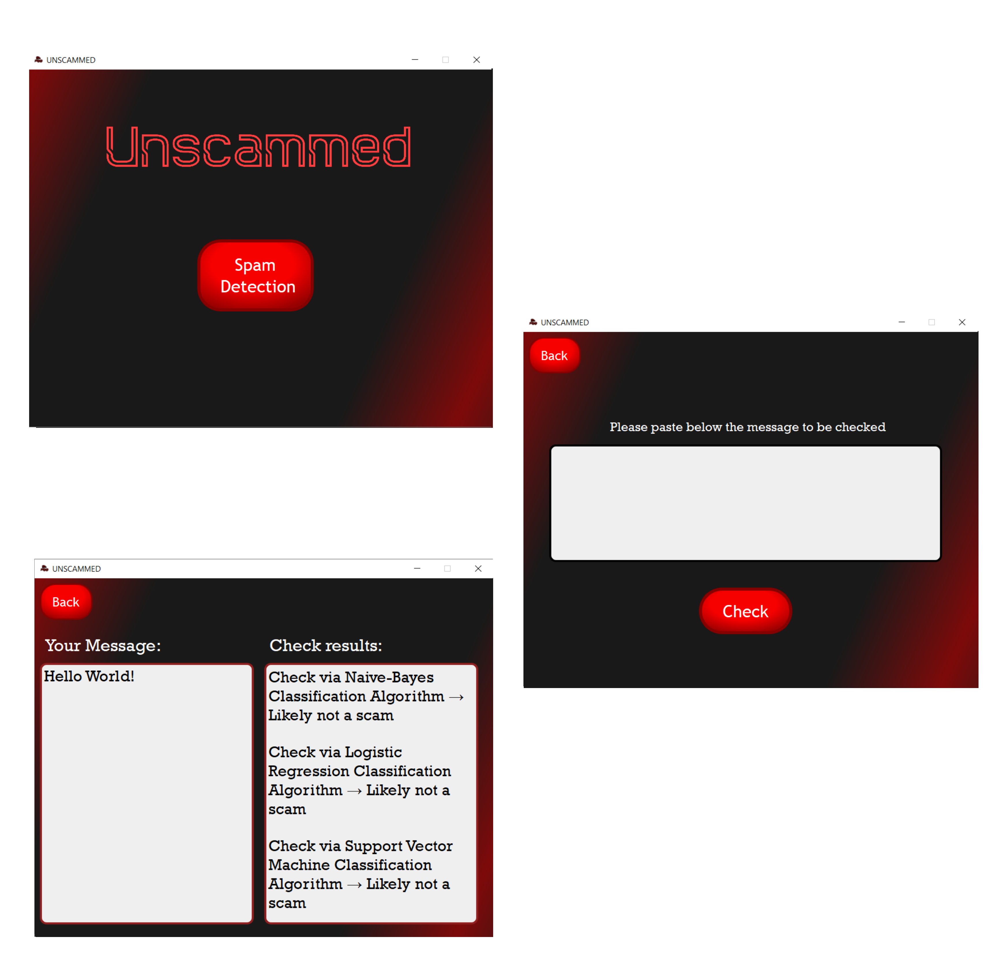

# Unscammed

&nbsp;

## Built with:

- Python 3.11.4;
- PyQT5 (+ QtDesigner);
- Jupyter Notebook (for ML algorithms' development);
- PyTest (for testing)
- \+ other packages listed in `requirements.txt`

&nbsp;

## How the project works:

- Different Classification Algorithms (Naive-Bayes, Logistic Regression and Support Vector Machine) have been trained on a merged dataset to predict whether messages are possibly spam or ham (non-spam);
- When a user inputs a message on the app, it will be checked against all three algorithms, thus giving the user the possibility to see the results of different approaches. The more algorithms detect the message as "spam", the more obvious it would be that the message is, indeed, a spam message.

&nbsp;

> [!NOTE]
> 1) After downloading the project, create a virtual environment for the folder and install the requirements within it with the command: `python -m pip install -r requirements.txt`
> 2) Run project with the command: `python unscammed.py`
> 3) Run tests with the command: `pytest functionality_test.py`
